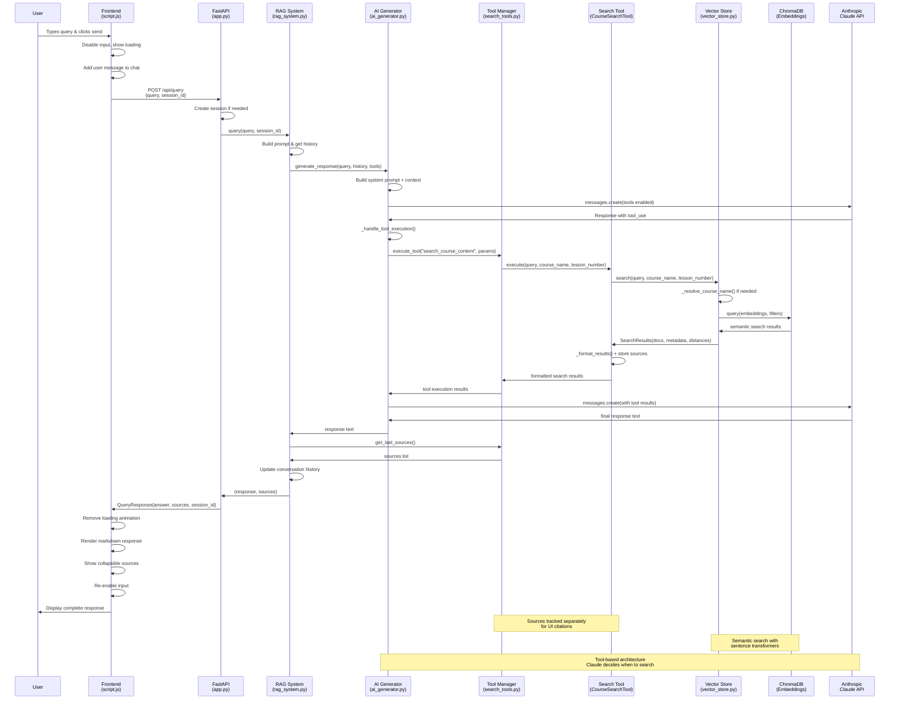

# RAG System Query Flow Diagram

## Flow Components Breakdown

### **Frontend Layer** 
- **User Interface**: Chat input, loading states, message display
- **API Communication**: HTTP POST to `/api/query`
- **Response Rendering**: Markdown parsing, source citations

### **API Layer**
- **FastAPI Endpoint**: Request validation, session management
- **Error Handling**: HTTP status codes, exception handling

### **RAG Orchestration**
- **Query Processing**: Prompt building, context management
- **Component Coordination**: AI ↔ Tools ↔ Vector Store

### **AI Processing**
- **Claude Integration**: System prompts, tool definitions
- **Tool Execution**: Dynamic tool calling based on query type
- **Response Generation**: Context-aware answer synthesis

### **Search Architecture**
- **Tool Manager**: Plugin system for extensible tools
- **Search Tool**: Course/lesson filtering, result formatting
- **Vector Store**: Semantic search, course name resolution

### **Data Layer**
- **ChromaDB**: Persistent vector storage
- **Embeddings**: Sentence transformers for similarity
- **Collections**: Separate course catalog + content storage

## Key Design Patterns

1. **Tool-Based Architecture**: Claude decides when to search vs use knowledge
2. **Semantic Resolution**: Fuzzy course name matching via embeddings  
3. **Parallel Source Tracking**: Search results + UI citations handled separately
4. **Session Continuity**: Conversation context maintained across queries
5. **Error Resilience**: Graceful fallbacks at each layer